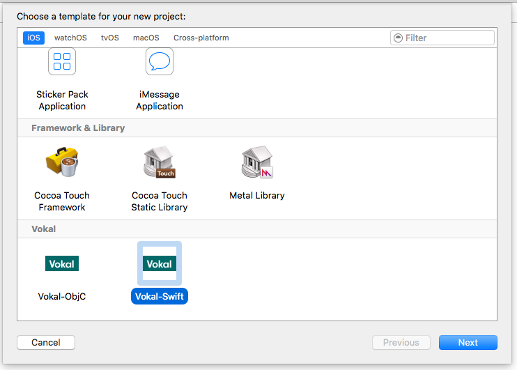
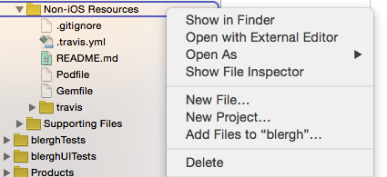
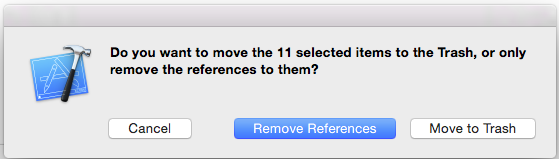
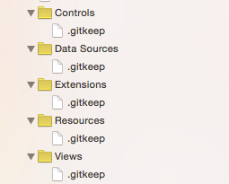
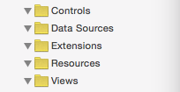
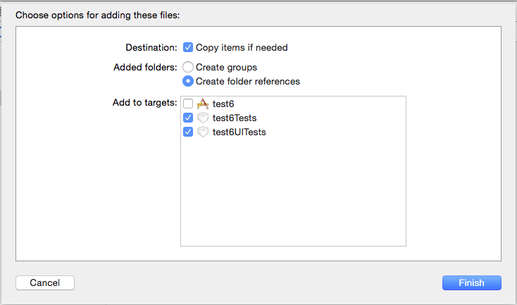

# Vokal Xcode Project Templates

This repo contains Objective-C and Swift templates to start up a new Vokal project. These templates are a good start, but don't produce a ready-to-go project. Be sure to follow the steps in *After creating a project* each time you use one of these templates. Also note that creating the Xcode project is just one step in the process of [setting up a new project](https://engineering.vokal.io/iOS/Creating-Projects.md.html); consult that documentation before following instructions here.

For people outside of Vokal: you'll need to make some adjustments after creating your project from these templates. In particular, you'll need to remove our private podspec repo from the `Podfile`, and update the certificate repo in `fastlane/Matchfile`. If you have issues beyond that, feel free to [drop us a note](mailto:ios@vokal.io).

## Maintaining these templates
Apple doesn't have documentation on managing templates like this, but [there is a third-party guide for Xcode 4](http://www.learn-cocos2d.com/store/xcode4-template-documentation/) that's still mostly correct for Xcode 8.

If you're updating the templates, you'll note that there are Vokal-fied versions of several templates in this project - this is to facilitate making sure that certain stock files which would otherwise be created are not created. These were forked from the Xcode 7 templates, but as of 8 beta 3, the base template had not changed significantly from the one included in 7.

Note that you may need to grab updated versions of these templates from the belly of Xcode when a new version of Xcode is released. As of Xcode 8, these templates can be found at the following paths:

* Projects: `/Applications/Xcode.app/Contents/Developer/Platforms/iPhoneOS.platform/Developer/Library/Xcode/Templates/Project Templates/iOS`
* Aggregate target: `/Applications/Xcode.app/Contents/Developer/Library/Xcode/Templates/Project Templates/Base/Other/Aggregate.xctemplate`

You'll also note that we have separate templates for Swift and Objective-C - there were several features for the Swift template which simply did not work at all without ripping it out into a separate template. Common code is within the `Vokal-Cocoa Touch Application Base.xctemplate` folder.

## Xcode 8
**If you're using Xcode 8**, tread with caution. The templates have been updated to use Swift 2.3 so that existing Swift 2.2 code will compile, but most of the pods we use have not been updated for Swift 2.3 or 3. We'll bump to Swift 3 once 8.0 is released and pods are updated. You should also update `PROVISIONING_PROFILE_SPECIFIER` in the `post_install` section of the Podfile to the team ID with a trailing slash.

Currently, mogenerator does not include output for Swift 3. There is a custom Swift 3 mogenerator template in the Scripts folder as a workaround for this. Add a `--template-path PROJECTNAME/Scripts/MOGSwift3Templates` option to the `MOGenerator.sh` file to use the template.

## Installation
To install or update the templates in Xcode:

- Clone or download this repository
- On the command line, `cd` into the `Xcode-Template` directory and run `./install.sh`
- Launch Xcode and create a new project. Confirm you see a Vokal category under iOS, as seen below.

## After Creating A Project

### 1. Remove unnecessary references

- Open up the `.xcodeproj` file. 

- Remove the `Non-iOS Resources` folder from the Xcode project by selecting that folder in the sidebar, right clicking, then selecting delete from the menu, then selecting "Remove References" in the dialog that pops up: 

- Using this same method, remove the reference to the `Scripts` folder as well.

- Remove the references to the `.gitkeep` files which were used to create the folder/group hierarchy, but leave the groups themselves: 

- Once those files are removed your groups should look like this: 

### 2. If You Added The Starter Network Utility

If you chose to include the Starter Network Utility when creating the project, you get a bunch of tests for free! The bad news is that templates are dumb, so you have to move them around. 

- Remove the references in "MoveToNonUITestTarget" in the same way you did the Non-iOS resources.

- Go into the folder hierarchy and find the `MoveToNonUITestTarget` folder. Start by selecting just the test files. Then drag the test files into the non-UI test target, and only add them to the non-UI test target. 

- Grab the `VOKMockData` folder and either the `HTTPSessionManager+MockData`category `.h` & `.m` files for Objective-C or the `HTTPSessionManager+MockData.swift` file for Swift. Drag them into the non-UI test target, but add them to both the non-UI and UI test targets:

**NOTE: Make sure you've selected "Create Folder Reference" so the mock data is added properly**.

You can then delete the `MoveToNonUITestTarget` from the filesystem as the test stuff has been moved over.

### 3. Cocoapod setup

- Close the project window in Xcode.

- On the command line, run `bundle install`. This will ensure that the necessary gems are installed for the build and test scripts that run on Travis, so that you can run them locally later on if needed. It will also generate `Gemfile.lock`, which should be committed so that the same versions of those gems will be installed on Travis. If this command fails, check that you have [RubyGems](https://rubygems.org/pages/download) and [Bundler](http://bundler.io/) installed.

- On the command line, run `pod install`. Be sure to launch the project from the newly-created `.xcworkspace` file.  NOTE: cocoapods ~> 1.0 is required.

### 4. For Swift Only

- The build phase that runs the [R.swift](https://github.com/mac-cain13/R.swift) script needs to be moved, since it cannot be positioned properly in the template. In the Build Phases for the main target, drag *R.swift Generation Script* up in the list so that it's right above *Compile Sources*

- Note that there's a build-time script to throw compiler warnings whenever you've added a `//WARN:` comment, similar to how `#warning` is used in Obj-C. Find and delete any warnings from this method. 

- There are a couple scripts which are included at the base project level which default to generating Objective-C code. In order to generate Swift files for DevsJustWantToHaveFun, you will need to update the scripts to use `swift` instead of `objc` for the `LANGUAGE` option. These scripts can be found in the `[project]/Scripts` folder. 

### 5. For All Projects

- For Objective-C projects, the Objective-Clean run script is already installed for you and the settings file is already in place. For Swift projects, SwiftLint is set up similarly. Fix any warnings that either utility generates when you build the workspace. If you get an error about Objective-Clean not being found, download and install the app following the [full instructions in our Objective-Clean docs](https://engineering.vokal.io/iOS/ObjCleanAndSwiftLint/README.md.html).

- Hit ⌘-U to run both the UI and Non-UI tests. Each set of tests should fail since you haven't set anything up yet. 

- Double-check the Travis configuration and add secure keys as needed. See our [Travis documentation](https://engineering.vokal.io/iOS/Fastlane-Travis-CI.md.html) for the full details on that. This step can be handled later, since most of the information needed for this probably isn't available yet.

- Find and address all the `TODO:`s in the boilerplate code.

## Notes On Scripts

All scripts added to a given project will be added to the `[project]/Scripts` folder. 

Build or Run scripts (designed to be run in conjunction with every single build or run which takes place within a given workspace) have been added to the appropriate place—either a post-build action or a Run Script Build Phase. 

Scripts tied to code generation are added to Run Script Build Phases in the Code Generation Scripts target. This target must be run manually to generate boilerplate code.

For Objective-C projects, this target runs the scripts for Cat2Cat and Mogenerator. For Swift, it only runs Mogenerator, since R.swift serves the same purpose as Cat2Cat in Swift projects.

Adjust the run scripts in this target as necessary. For example, if your project isn't using Core Data, you can remove the Mogenerator script build phase. You can also add additional build phases if you need to run other scripts.
